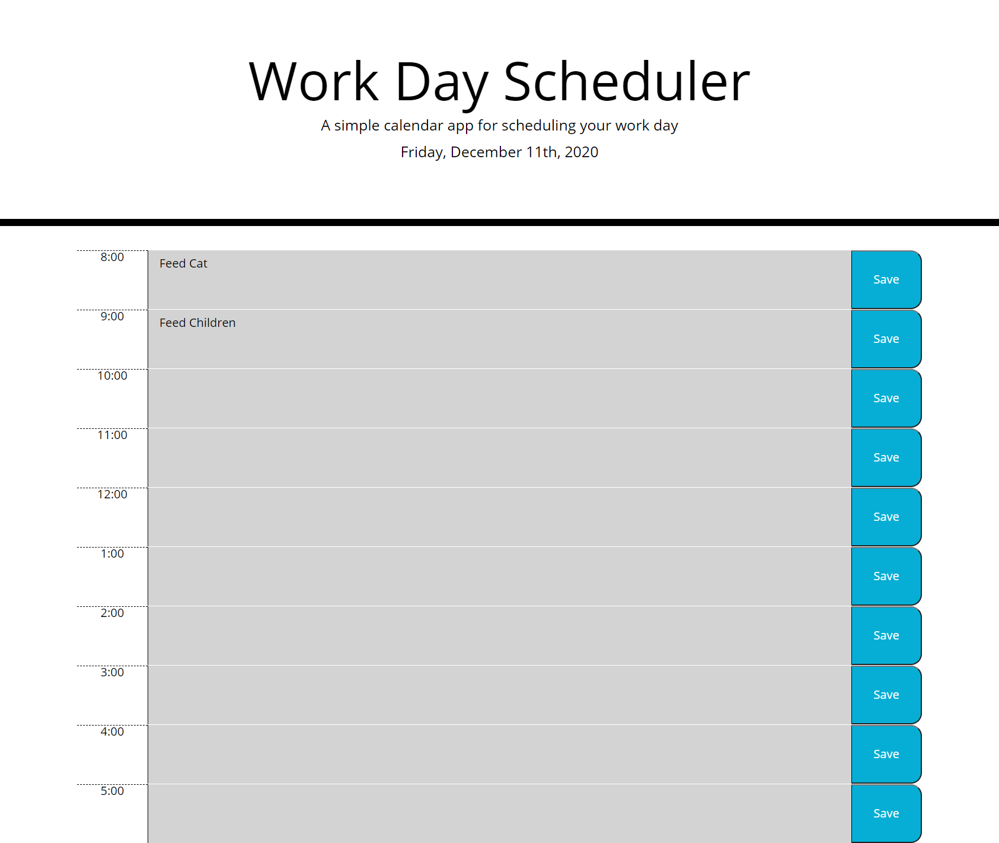

# # This is a simple day planner
## Table of contents
- [General Info](#general-info)
- [Technologies](#technologies)
- [Next_Steps] (#Next Steps)
- [Author](#author)
## General Info
This is a simple day planner which meets the following conditions:
* Functional, deployed application
* GitHub repository with README describing the project
* User can save events for each hour which will dynamically update the HTML & CSS using jQuery.
* Use of moment.js to access current time, date, and day.
* Current day displayed at top of screen.
* Time blocks are color coded to indicate past, present, and future.
* User can save events for each time block.
* When page is refreshed the saved events persist.
## Main Page

## Technologies
This project is created with:
- [HTML](https://html.com/)
- [CSS](https://www.w3.org/Style/CSS/Overview.en.html)
- [Javascript](https://www.javascript.com/)
- [jQuery] (https://jquery.com/)
- [moment.js] (https://momentjs.com/)
- [bootstrap] (https://getbootstrap.com/)
- [googleapis] (https://developers.google.com/apis-explorer)
- [fontawesome] (https://fontawesome.com/)
## Next Steps
- Retrieve local storage to populate to page. 
- Use fontawesome icons for save button.
## Author
- Shawn Flanigan